# Ghost Ball: website update (project 05)

Everything for adding Ghost Ball to the website. Tap any link below to open that file.
To install, copy this folder's contents into the site's root folder, next to `index.html`.

## Changed files (replace yours)
- [index.html](index.html): the home page with Ghost Ball added: a tile, a list entry, the About-page shortcut and the full project panel
- [site.webmanifest](site.webmanifest): the description now mentions Ghost Ball

## New files
- [ghost-ball/index.html](ghost-ball/index.html): the app itself, served at `/ghost-ball/`
- [assets/css/ghostball.css](assets/css/ghostball.css): styles for the Ghost Ball panel
- [assets/js/ghostball.js](assets/js/ghostball.js): the drag-the-balls demo and the overlay wiring
- [assets/media/ghostball/ghostball-explainer.mp4](assets/media/ghostball/ghostball-explainer.mp4): the explainer video (14 MB)
- [assets/media/ghostball/ghostball-explainer.en.vtt](assets/media/ghostball/ghostball-explainer.en.vtt): its captions
- [GHOST_BALL_README.txt](GHOST_BALL_README.txt): install notes and how it connects to `main.js`

Unchanged: `404.html`, `robots.txt` and the rest of `assets/`.

## Images used on the page

### From photo to shot (the app's own working on its sample table)
| | |
|---|---|
| 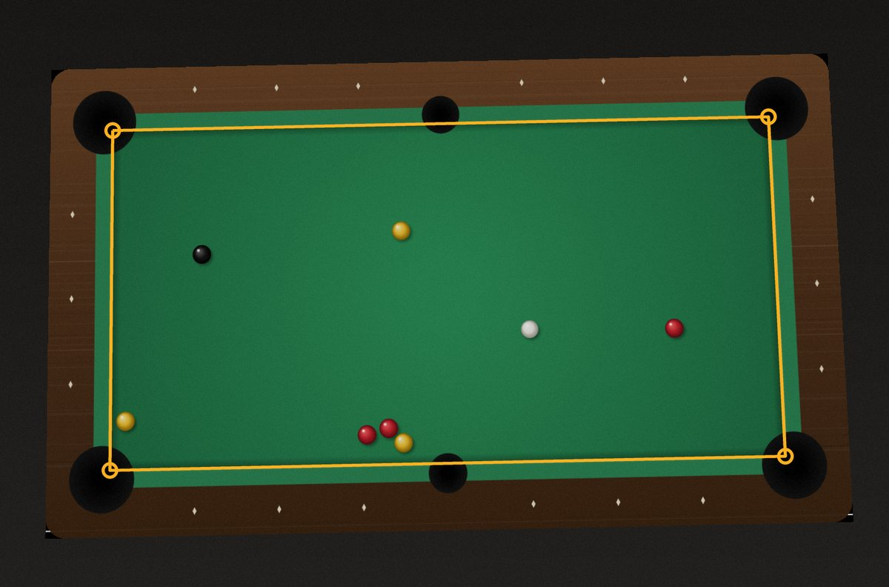 1. Find the table | 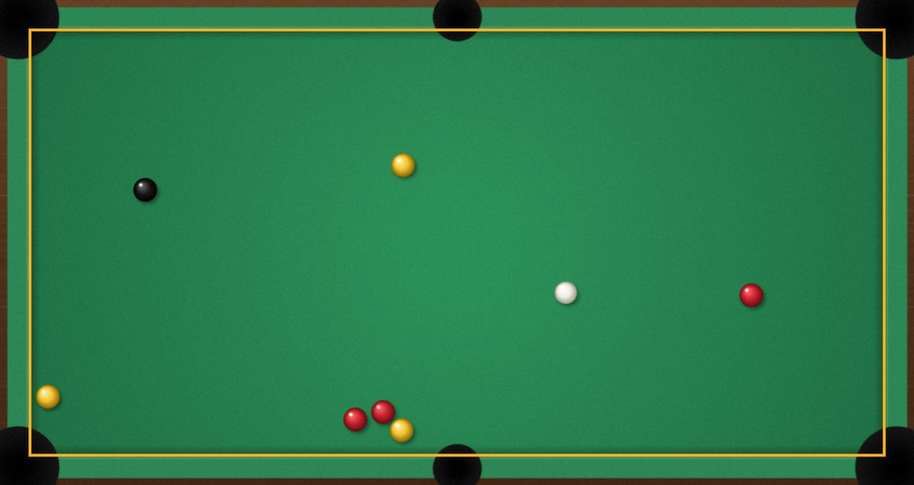 2. Flatten it |
| 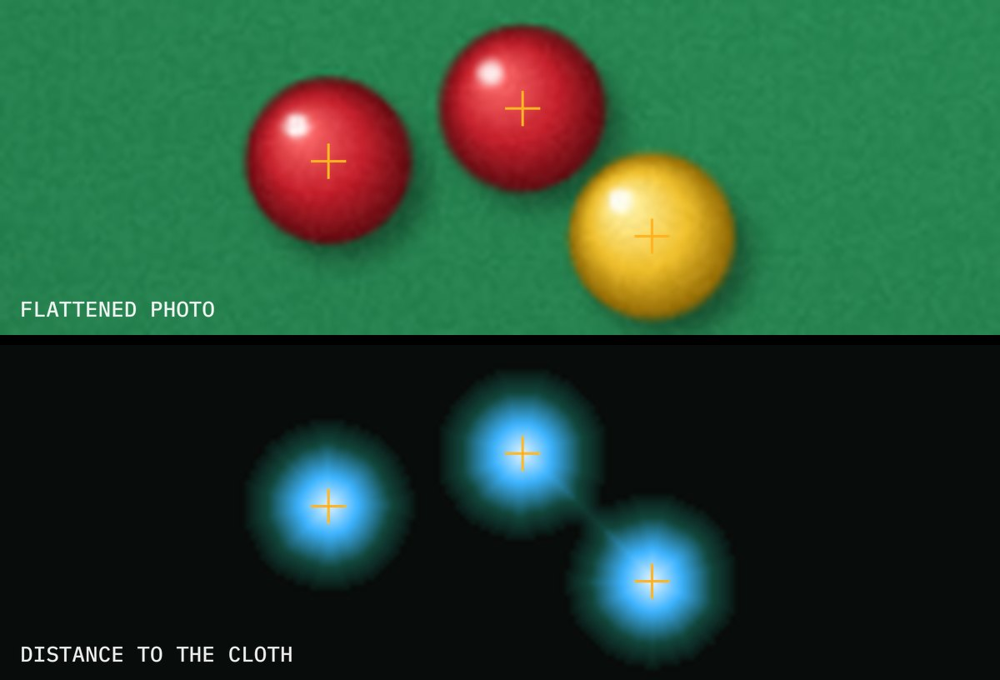 3. Find the balls | 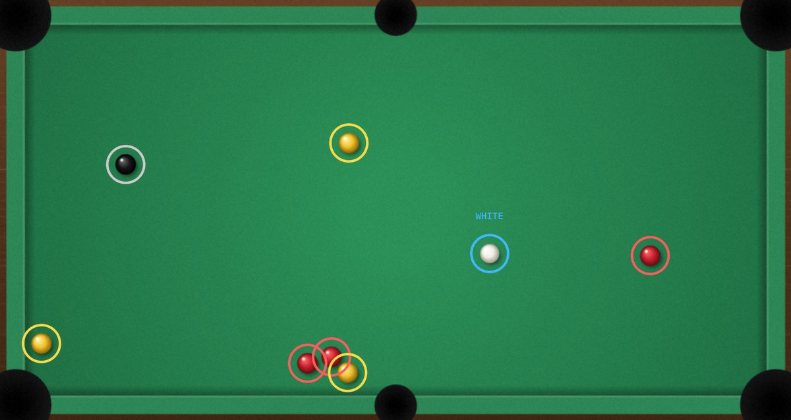 4. Name them |
| 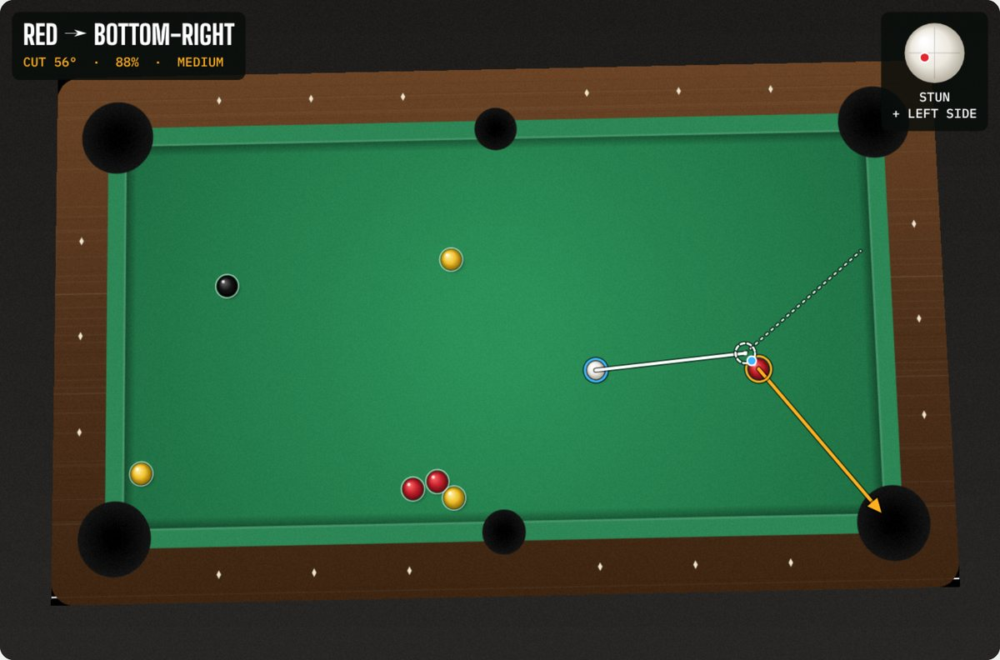 5. Solve every shot | 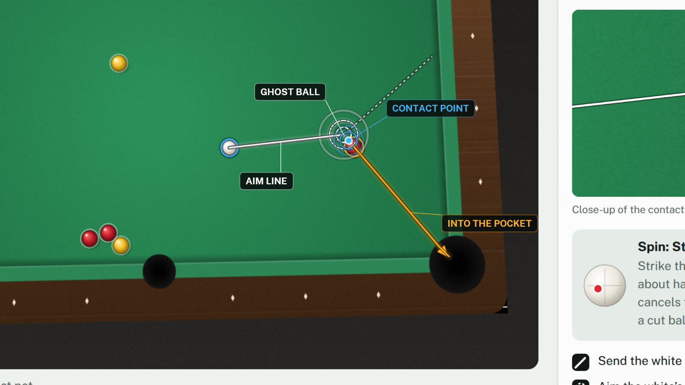 Video poster |

### Shot types
| | |
|---|---|
| 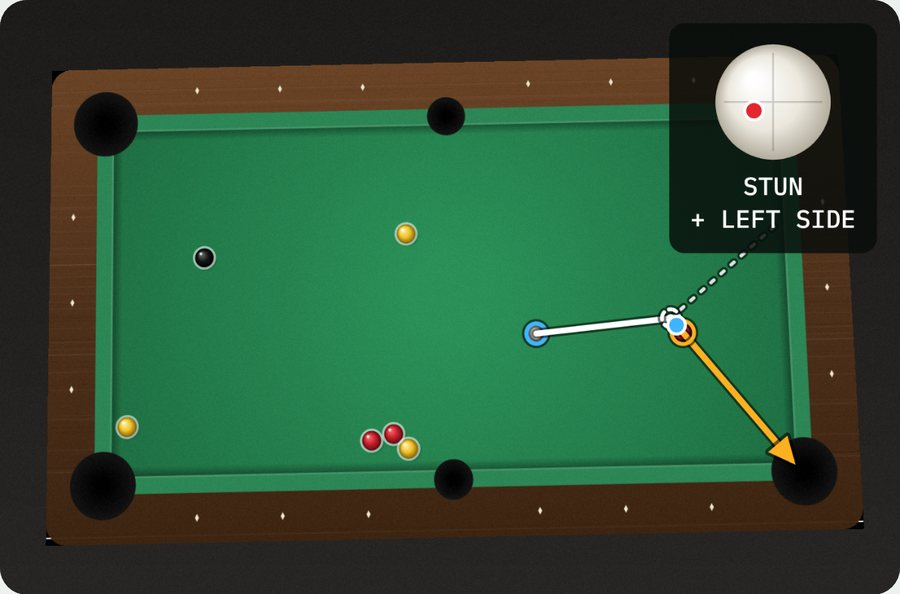 Straight, 88% | 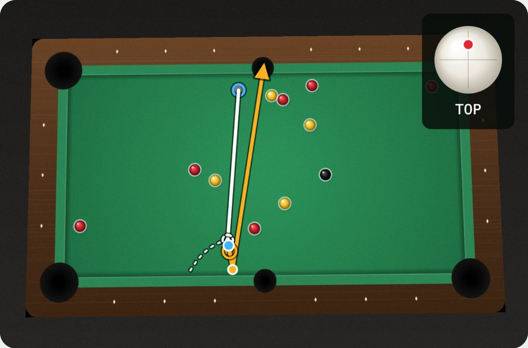 Bank, 43% |
| 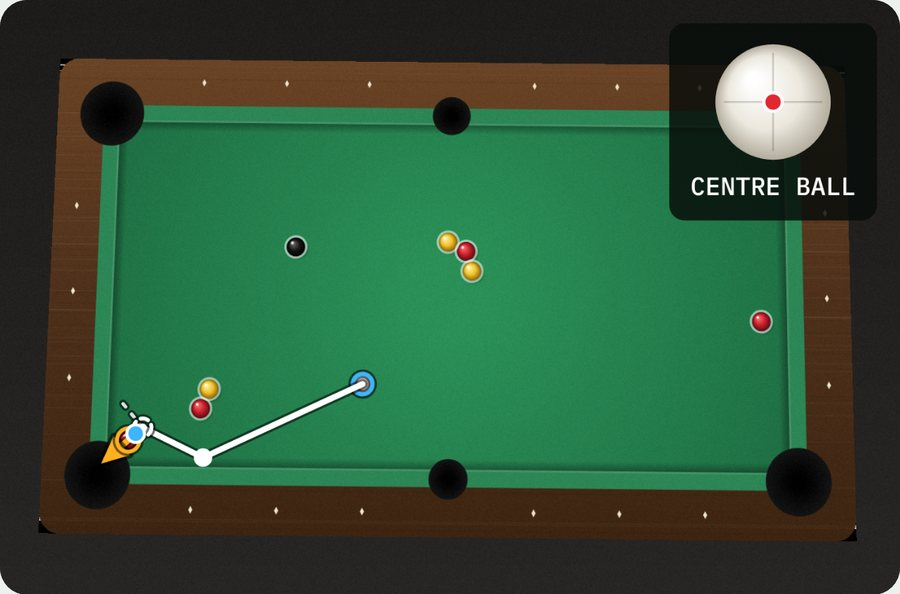 Kick, 71% | 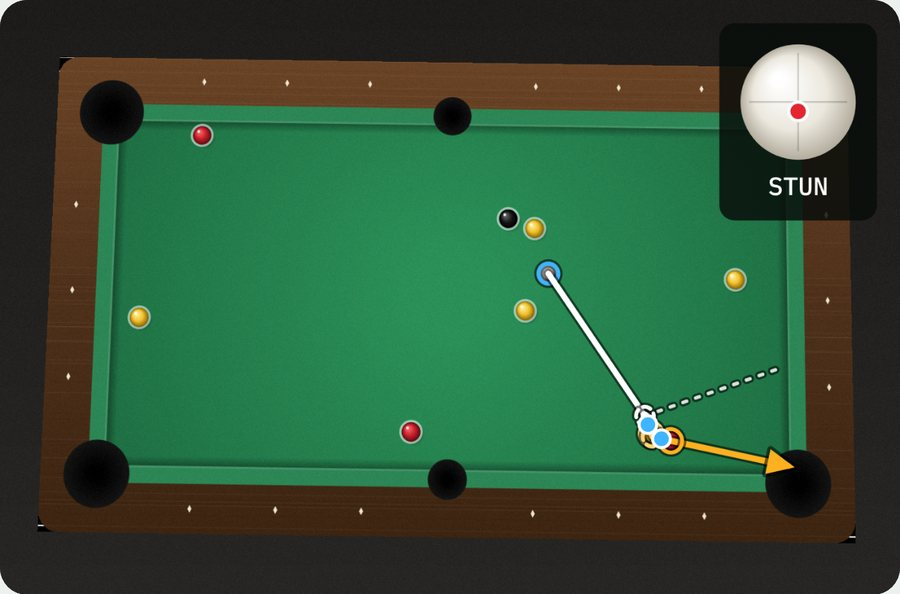 Combination, 93% |

### Using it
| | |
|---|---|
| 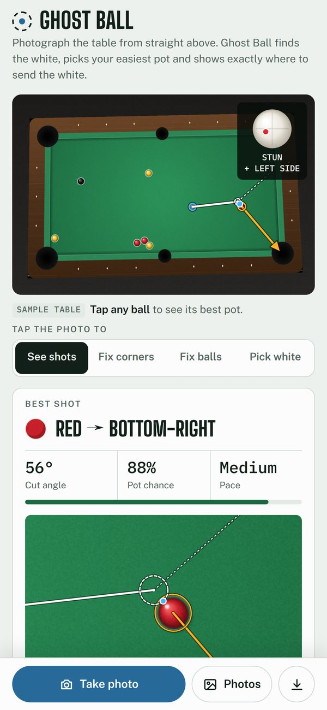 | 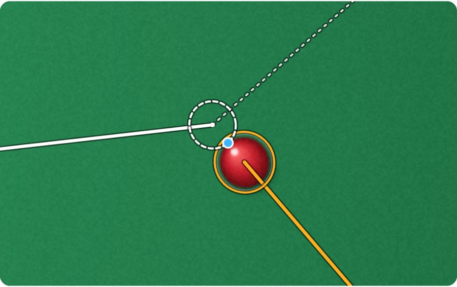 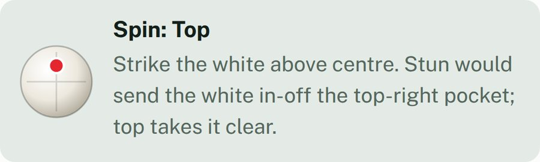 |

### The maths (formula images)
| | |
|---|---|
| Flattening the photo | 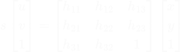 |
| The ghost ball | 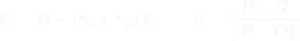 |
| The pocket window | 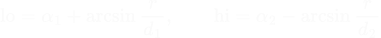 |
| Error spread | 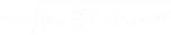 |
| Pot chance | 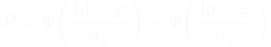 |
| Banks: mirror the pocket |  |
| Combinations | 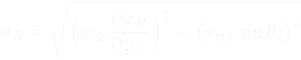 |
| Where the white goes |  |

The diagrams beside each formula are drawn inline in `index.html`, so they only show on the live page.
